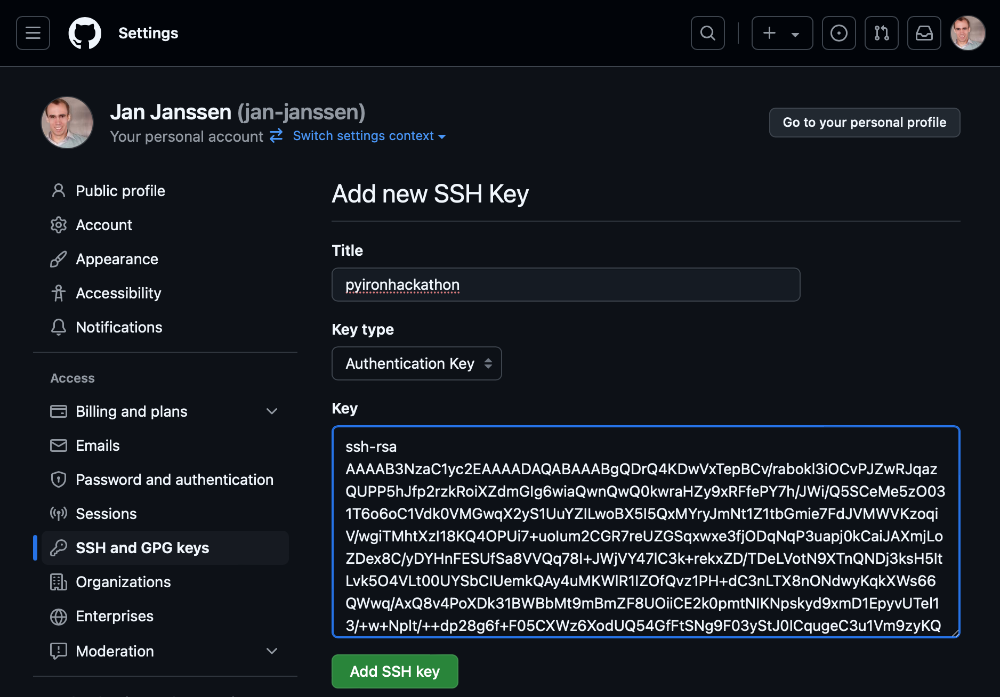
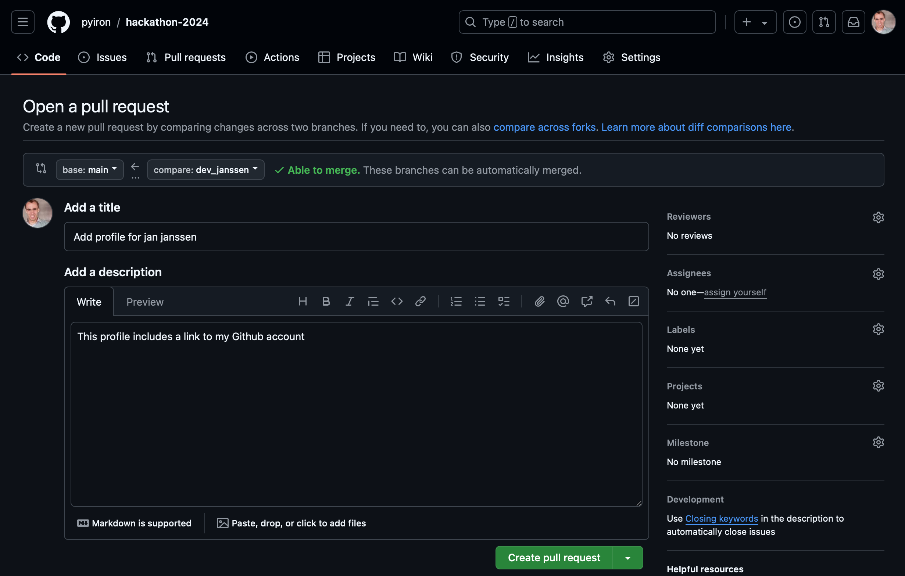
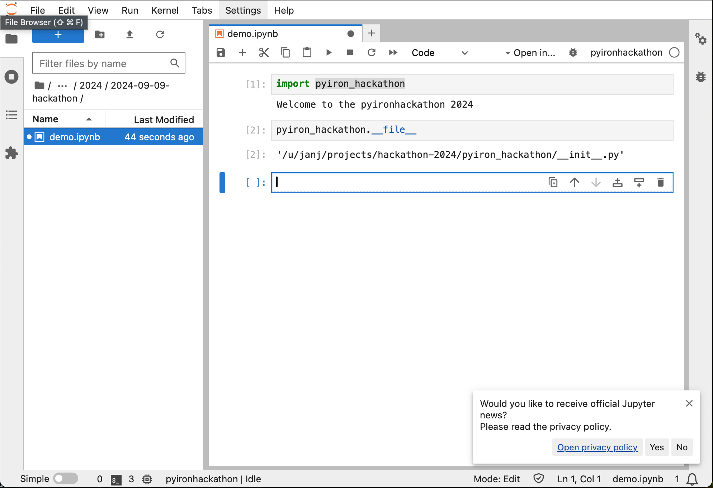

# Setup your Development Environment
## Create an SSH Key
The official documentation from Github on how to create an SSH key to use git via SSH is available at [https://docs.github.com](https://docs.github.com/en/authentication/connecting-to-github-with-ssh/adding-a-new-ssh-key-to-your-github-account). Here the required steps are briefly summarized: 

### Create SSH key on Linux
On the command line execute `ssh-keygen` command to create a new SSH key in your home directory (here: `/u/janj/.ssh`) named `github`: 
```
ssh-keygen 
>>> Generating public/private rsa key pair.
>>> Enter file in which to save the key (/u/janj/.ssh/id_rsa):
/u/janj/.ssh/github
>>> Enter passphrase (empty for no passphrase):

>>> Enter same passphrase again:

>>> Your identification has been saved in /u/janj/.ssh/github
>>> Your public key has been saved in /u/janj/.ssh/github.pub
>>> The key fingerprint is:
>>> SHA256:E1Gj+CTHBGwXHokM++yfBYVAtWAShIBsvDNp0oh0/zU janj@cmti001
>>> The key's randomart image is:
>>> +---[RSA 3072]----+
>>> |=. o=**+*+o      |
>>> |.=.. +=Bo* .     |
>>> |+o+ o.o.X .      |
>>> |+*.  + = E       |
>>> |o o   + S .      |
>>> |     . . o       |
>>> |      .   .      |
>>> |       . o       |
>>> |        o        |
>>> +----[SHA256]-----+
```
This creates two files, a private SSH key `/u/janj/.ssh/github` and a public key `/u/janj/.ssh/github.pub`. Never share your private key. 

Modify your SSH configuration file `~/.ssh/config` to use your newly created SSH private key `/u/janj/.ssh/github` when accessing Github. Use `vim ~/.ssh/config` and modify the config by pressing `i` for insert:
```
Host github.com
    HostName github.com
    User git
    IdentityFile ~/.ssh/github
```
You can write the changes and quit `vi` by pressing `esc` followed by `:wq`. 

### Add your public SSH key to Github
* Access the SSH keys section of the Github Settings under: [Settings > SSH and GPG keys](https://github.com/settings/keys)
* Click the green "Add SSH key" button in the top right corner.
* Copy the content of your public key `/u/janj/.ssh/github.pub` into the form and click the "Add SSH key" button to confirm.



### Checkout a Repository from Github
Navigate to the directory where you want to store your Github repositories on your Linux system, for example `~/projects` which can be created using `mkdir -p ~/project`:
```
cd ~projects
git clone git@github.com:pyiron/hackathon-2024.git
>>> Cloning into 'hackathon-2024'...
>>> remote: Enumerating objects: 3, done.
>>> remote: Counting objects: 100% (3/3), done.
>>> remote: Compressing objects: 100% (2/2), done.
>>> remote: Total 3 (delta 0), reused 0 (delta 0), pack-reused 0 (from 0)
>>> Receiving objects: 100% (3/3), done.
cd hackathon-2024
ls
>>> README.md participants
```
Navigate into the `participants` folder, checkout a new branch `dev_<lastname>`, create a profile for yourself `<firstname>-<lastname>.md`, add it to git and push your changes to Github. 
```
cd participants
git checkout -b dev_janssen
>>> Switched to a new branch 'dev_janssen'
vim jan-janssen.md
```
Again you can insert information by switching to insert mode by pressing `i`, for example you can add a link to your Github profile:
```
Github: https://github.com/jan-janssen
```
Afterwards you can write the changes to the file by pressing `esc` followed by `:wq`. This file is then added and commited to your branch: 
```
git add jan-janssen.md
git commit -m "Add profile for jan janssen"
>>> [dev_janssen 5bc070a] Add profile for jan janssen
>>>  1 file changed, 1 insertion(+)
>>>  create mode 100644 participants/jan-janssen.md
git push
>>> fatal: The current branch dev_janssen has no upstream branch.
>>> To push the current branch and set the remote as upstream, use
>>> 
>>>     git push --set-upstream origin dev_janssen
>>> 
git push --set-upstream origin dev_janssen
>>> Enumerating objects: 5, done.
>>> Counting objects: 100% (5/5), done.
>>> Delta compression using up to 40 threads
>>> Compressing objects: 100% (2/2), done.
>>> Writing objects: 100% (4/4), 378 bytes | 378.00 KiB/s, done.
>>> Total 4 (delta 0), reused 0 (delta 0), pack-reused 0
>>> remote: 
>>> remote: Create a pull request for 'dev_janssen' on GitHub by visiting:
>>> remote:      https://github.com/pyiron/hackathon-2024/pull/new/dev_janssen
>>> remote: 
>>> To github.com:pyiron/hackathon-2024.git
>>>  * [new branch]      dev_janssen -> dev_janssen
>>> branch 'dev_janssen' set up to track 'origin/dev_janssen'.
```

### Create a Pull Request on Github
Follow the suggestion above to create a pull request for your new branch, visit [https://github.com/pyiron/hackathon-2024/pull/](https://github.com/pyiron/hackathon-2024/pull/) at the top you shoud see a notification about your new branch and a green button to `compare & pull request`:



Create your pull request by pressing the green `Create pull request` button in the bottom center. On the next screen you can directly merge your pull request by clicking the green `Merge pull request` button. This only applies to this repository, for all other repositories in the pyiron organisation please wait until somebody has reviewed your pull request before merging it.

### Summary 
Now you learned how to creare an SSH key, use this SSH key to checkout git repositories from Github, create your own branches, commit changes open pull requests and merge them.  

## Development Environment 
### Setup Conda Environment
If you are using the development environment on CMTI cluster, you can skip the first step. If you are using a different Linux workstation the following steps might be required:
* Download the latest version of Miniforge [github.com/conda-forge/miniforge/releases](https://github.com/conda-forge/miniforge/releases)
* For a Linux installation with Intel or AMD processor download the `Mambaforge-24.7.1-0-Linux-x86_64.sh` file. The version number `24.7.1-0` might change in the future.
* Download the latest conda environment file from [github.com/pyiron/docker-stacks/releases](https://github.com/pyiron/docker-stacks/releases)
* For the purpose of this hackathon we use the CMTI profile `pyiron_mpie_cmti_2024-09-09.yml`. The date `2024-09-09` might change in the future, using the latest environment is recommended.
* Create an environment using `conda env create -f pyiron_mpie_cmti_2024-09-09.yml -p /home/janssen/pyironhackathon`. In this example the environment is created in `/home/janssen/pyironhackathon`.
* Activate this environment using `conda activate /home/janssen/pyironhackathon`

### Modify the Python Path in your Jupyter Notebook
The easiest way to modify your `PYTHONPATH` is inside your jupyter notebook. Open a new jupyter notebook using the latest kernel and add the following lines: 
```
import sys
sys.path.append("/u/janj/projects/hackathon-2024")

import pyiron_hackathon
>>> Welcome to the pyironhackathon 2024
pyiron_hackathon.__file__
>>> '/u/janj/projects/hackathon-2024/pyiron_hackathon/__init__.py'
```

In this example `/u/janj/projects/hackathon-2024` refers to the location where the hackathon repository [github.com/pyiron/hackathon-2024](https://github.com/pyiron/hackathon-2024) is stored on your system. 

### Create your own Jupyter Kernel 
While it is technically possible to add the python path to each of your Jupyter notebooks, a more elegant way is to include the `PYTHONPATH` inside your jupyter kernel. To create your own jupyter kernel we first have to find your current kernels. Check the location of your `conda` executable:
```
which conda
>>> /cmmc/ptmp/pyironhb/mambaforge/envs/pyiron_mpie_cmti_2024-09-02/bin/conda
```
Navigate to the folder which includes the current kernel: 
```
cd /cmmc/ptmp/pyironhb/mambaforge/envs/pyiron_mpie_cmti_2024-09-02/share/jupyter/kernels/python3
ls
>>> kernel.json  logo-32x32.png  logo-64x64.png  logo-svg.svg
```
Create a directory for your own kernel in your home directory and copy the current kernel: 
```
mkdir -p ~/.local/share/jupyter/kernels/pyironhackathon
cp /cmmc/ptmp/pyironhb/mambaforge/envs/pyiron_mpie_cmti_2024-09-02/share/jupyter/kernels/python3/* ~/.local/share/jupyter/kernels/pyironhackathon
cd ~/.local/share/jupyter/kernels/pyironhackathon
ls
>>> kernel.json  logo-32x32.png  logo-64x64.png  logo-svg.svg
```
Modify the `kernel.json` file, be careful it is `JSON` file, so it is sensitive to the placement of `,` and spaces. The current file should look like this 'cat kernel.json`:
```
{
 "argv": [
  "/cmmc/ptmp/pyironhb/mambaforge/envs/pyiron_mpie_cmti_2024-09-02/bin/python",
  "-m",
  "ipykernel_launcher",
  "-f",
  "{connection_file}"
 ],
 "display_name": "server version (python3.11)",
 "language": "python",
 "metadata": {
  "debugger": true
 },
 "env": {
  "CONDA_PREFIX": "/cmmc/ptmp/pyironhb/mambaforge/envs//pyiron_mpie_cmti_2024-09-02/"
 }
}
```
Add a `,` at the end of the `CONDA_PREFIX` line and afterwards add new line with the `PYTHONPATH` but without a `,` at the end. The final configuration should look like this: 
```
{
 "argv": [
  "/cmmc/ptmp/pyironhb/mambaforge/envs/pyiron_mpie_cmti_2024-09-02/bin/python",
  "-m",
  "ipykernel_launcher",
  "-f",
  "{connection_file}"
 ],
 "display_name": "pyironhackathon",
 "language": "python",
 "metadata": {
  "debugger": true
 },
 "env": {
  "CONDA_PREFIX": "/cmmc/ptmp/pyironhb/mambaforge/envs//pyiron_mpie_cmti_2024-09-02/",
  "PYTHONPATH": "/u/janj/projects/hackathon-2024"
 }
}
```
For asthetics you can also modify the `display_name` to simplify finding your kernel. 

If you installed your own conda version replace `/cmmc/ptmp/pyironhb/mambaforge/envs/pyiron_mpie_cmti_2024-09-02/bin/python` with the location of your python executable and `/cmmc/ptmp/pyironhb/mambaforge/envs//pyiron_mpie_cmti_2024-09-02/` with the path to your environment listed by the `which conda` command. 

After restarting your jupyter server you should be able to select your kernel and directly import `pyiron_hackathon` without setting the `PYTHONPATH` inside your jupyter notebook. 



### Summary 
You now learned how to modify your `PYTHONPATH` to load any kind of python module, to directly use your modified python module in your jupyter notebook. 
